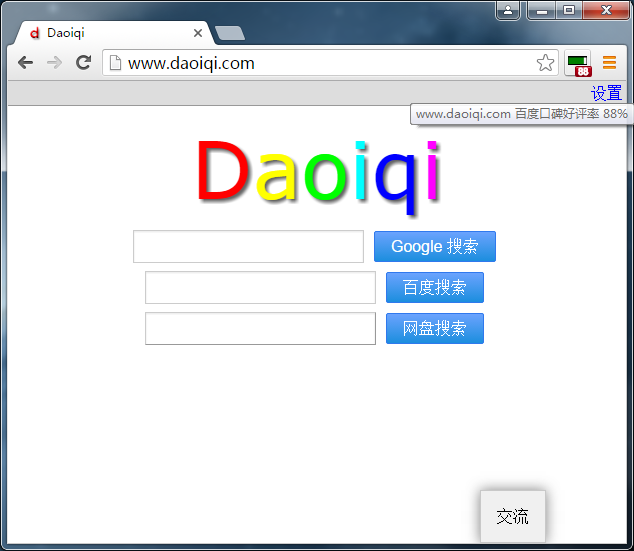
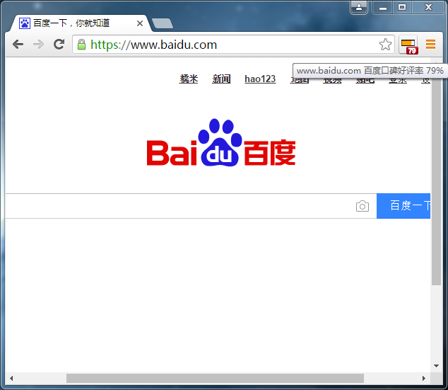

Website Impress
=========================

Chrome 插件下载地址： <https://chrome.google.com/webstore/detail/fjfddiiaeehjogpabflgicipdgdfljof/>

在互联网上经常充斥着一些垃圾网站，网站缺少真实的内容或者带有欺骗性的内容，欺骗用户的感情，影响用户的使用。

** *这类网站应该被揪出来，并且不建议逗留。* **

无意做一个点评网站，本插件的数据是利用[百度口碑](http://koubei.baidu.com/)的数据来展示的。

如果有什么好的点评数据，欢迎给我留言。

## 评分说明

从百度口碑获取好评率。好评率理论上从 `0-100%` 的。
由于百度口碑的打分最低是`一星`，所以好评率最低是 `20% `。

数字太大不方便看，因此从`0-100`的分数映射为 `0-10`分。

* `0-59` 红色，好评率在0-59%之间，实际最低应该是20%。对应就是一星～三星之间。
* `60-79` 橙色，好评率在60%-79%之间。对应在三星～四星之间。
* `80-100` 绿色，好评率在80%-100%之间。对应在四星和五星。

## demo

